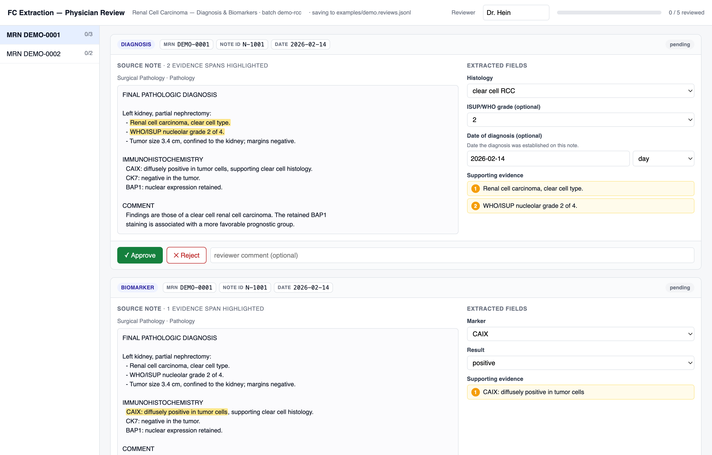

[](https://github.com/DavidHein96/OncAIReviewApp/actions/workflows/ci.yml)
[](https://www.python.org/downloads/)

# oncai-review

A local, dependency-free web app for physicians to review structured extractions
from clinical notes — approve, reject, or edit each extracted event, with the
source note and supporting evidence shown side by side.

The reviewer opens a `*.review_pkg.json` package, adjudicates each event, and the
verdicts are written to a `*.reviews.jsonl` sidecar. Everything runs on
`localhost` — **no data leaves the machine** and no network calls are made.



> The screenshot above is the bundled demo (`examples/demo.review_pkg.json`) —
> entirely synthetic data, no real patients.

## Highlights

- **Standard library only.** `server.py` imports nothing outside the Python
  standard library, so it can be frozen into a single shareable executable with
  no Python install, virtualenv, or database required on the reviewer's machine.
- **Runs locally.** Binds to `127.0.0.1`, auto-picks an open port, and opens the
  browser for you.
- **Evidence-first UI.** Each extracted field is shown next to the source note,
  with the model's verbatim evidence spans highlighted inline.
- **Append-only audit log.** Verdicts are written as JSONL (one line per save,
  last write per event wins), so a review session is fully reconstructable.

## Quickstart

Requires Python 3.11+. No dependencies to install. Try it against the bundled
demo package:

```bash
python server.py --package examples/demo.review_pkg.json
```

Your browser opens to the review UI shown above. That's the whole app.

## Running from source

```bash
# Start empty and pick a package in the browser file picker:
python server.py

# ...or open a package immediately:
python server.py --package path/to/batch.review_pkg.json
```

Then review in the browser tab that opens. Verdicts are saved to:

- the package's folder, when you pass `--package`, or
- `~/Documents/oncai_reviews/<batch>.reviews.jsonl`, when you open a package from
  the in-app file picker (the browser can't reveal the chosen file's folder, so a
  stable home-dir location keyed by batch name is used).

### CLI options

| Flag              | Default             | Description                                                                 |
| ----------------- | ------------------- | --------------------------------------------------------------------------- |
| `--package`, `-p` | _(none)_            | Path to a `*.review_pkg.json`. If omitted, pick one in the app.             |
| `--reviews`       | _alongside package_ | Output reviews JSONL path.                                                  |
| `--host`          | `127.0.0.1`         | Host to bind.                                                               |
| `--port`          | `8765`              | Preferred port; auto-falls back to an open one if busy (`0` = OS-assigned). |
| `--reviewer`      | _(empty)_           | Reviewer name stamped on each verdict.                                      |
| `--no-browser`    | _off_               | Do not auto-open a browser.                                                 |

## Building standalone executables

`server.py` is designed to be frozen with [PyInstaller](https://pyinstaller.org/)
into a single file a collaborator can run with no Python install:

```bash
# Windows uses ';' as the --add-data separator; macOS/Linux use ':'
uv run pyinstaller --onefile --name oncai-review --add-data "web:web" server.py
```

The `--add-data` flag bundles the web assets (and `pyproject.toml`, so the frozen
binary can report its own version); at runtime they are unpacked from
`sys._MEIPASS`, so the one-file binary stays self-contained.

The `.github/workflows/build.yml` workflow builds **Windows (x64), Linux (x64),
and macOS (arm64)** binaries in one matrix run, naming each asset with the
semantic version (e.g. `oncai-review-0.3.0-windows-x64.exe`). It runs two ways:

- **On demand** — from the **Actions** tab ("Build standalone executables" →
  **Run workflow**); the binaries are uploaded as workflow artifacts.
- **On a new GitHub Release** — the per-platform binaries are built and attached
  directly to that release as downloadable assets.

macOS ships a double-clickable `.app` bundle (built with `--windowed`, zipped
with `ditto`) rather than a bare binary. Because it's **unsigned**, reviewers do
a one-time Gatekeeper approval on first launch — hand them
[`docs/RUNNING-ON-MAC.md`](docs/RUNNING-ON-MAC.md). Build one locally with
`make build-app`. (A bare downloaded binary can't be double-clicked and would
need Terminal, which is why the Mac target is a `.app`.)

## Development

A `Makefile` wraps the common tasks — run `make help` to list them:

```bash
make install   # set up dev tooling (uv dev group + npm dev deps)
make demo      # run the app against the bundled demo package
make lint      # ruff + ty + eslint + prettier --check
make format    # auto-format: ruff + prettier + eslint --fix
make test      # Python test suite (pytest)
make test-js   # front-end test suite (node --test)
make check     # lint + all tests
make build     # build a single-file executable into dist/
```

The Python suite exercises the pure helpers, the append-only verdict log
(replay + last-write-wins), and full HTTP round-trips against a live server —
including the static-file path-traversal guard. The front-end suite uses Node's
built-in test runner to cover the tricky pure helpers in `app.js` — the
order-insensitive change detection and the whitespace-flexible evidence
highlighter. Linting/formatting is `ruff` + `ty` (Python) and `eslint` +
`prettier` (JS) — dev-only tools; the app itself still ships dependency-free. CI
runs all of it: Python tests on Linux/Windows/macOS across 3.11 and 3.13, plus
the JS lint + tests.

See [DESIGN.md](docs/DESIGN.md) for the architecture and the reasoning behind the
key decisions (stdlib-only, append-only log, the security guard, and more).

## The review package format

A `*.review_pkg.json` is a single JSON object with:

- `field_schema` — per-event-type field definitions that drive the editable form
  (label, control type, options, etc.).
- `patients` — a list of patients, each with their `mrn`, their source `notes`,
  and the extracted `events` to review.
- optional metadata: `definition_name`, `batch`, `generated_at`.

The matching `*.reviews.jsonl` output has one JSON object per saved verdict:
`event_key`, `mrn`, `verdict` (`approved` / `rejected`), any field `edits`, a
free-text `comment`, the `reviewer`, and a `reviewed_at` timestamp.

## Repository layout

```
Makefile                        # dev/build/run tasks (make help)
server.py                       # the localhost review server (stdlib only)
web/
  index.html                    # app shell + package picker
  app.js                        # review UI (vanilla JS, no build step)
  app.test.js                   # front-end tests (node --test, no deps)
  style.css
tests/test_server.py            # pytest suite (pure helpers + live HTTP)
examples/demo.review_pkg.json   # synthetic demo package
docs/
  screenshot.png                # README screenshot
  DESIGN.md                     # architecture notes
.github/workflows/
  ci.yml                        # lint + test matrix (Linux/Windows/macOS)
  build.yml                     # multi-OS executable build (manual + on release)
```

## License

Copyright (c) 2026 The University of Texas Southwestern Medical Center and David M Hein, Lyda Hill Department of Bioinformatics.

OncAI is source-available for academic research use under the custom UT Southwestern academic research license in [`LICENSE`](LICENSE). Commercial use and redistribution by for-profit entities are prohibited.
